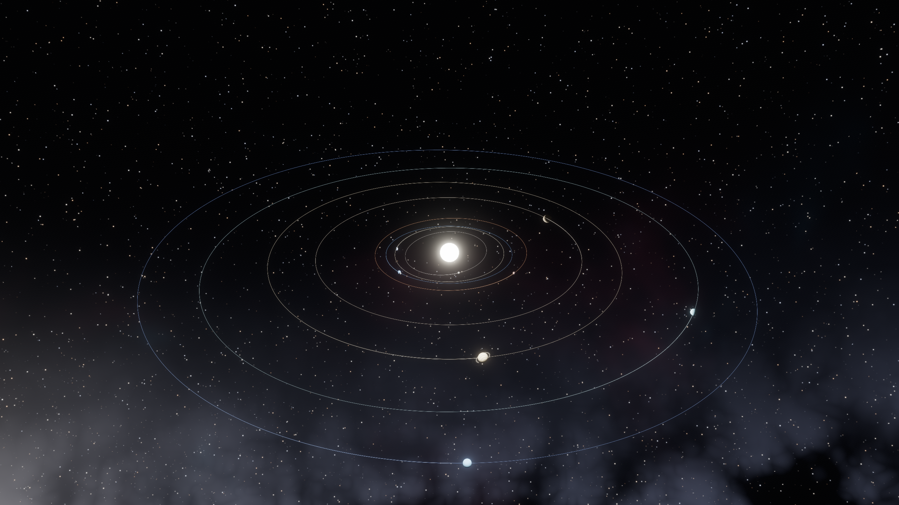

# orrery

An astronomically accurate, animated solar system for your desktop background.

Real planetary positions from JPL Horizons, refreshed once a year and accurate
to a tenth of an arcsecond, against the real sky: 8,404 catalogued stars and 20
constellation figures, all where they actually are. (A catalogue of 23 deep-sky
objects is compiled in and verified too, awaiting a rendering treatment that
does them justice.) Rendered in HDR with wgpu. No texture assets — the whole
thing is one binary.



## What "accurate" means here

Positions come from **JPL Horizons**, looked up once a year.

The orrery asks Horizons for each planet's real *osculating* orbit — the orbit
it is instantaneously on — at monthly epochs covering the year ahead, then
propagates from whichever epoch is nearest. Because the propagation interval is
then a couple of weeks rather than decades, the perturbations planets exert on
each other barely have time to accumulate. One request per body covers a whole
year, since Horizons returns every epoch in a single response.

Measured against Horizons state vectors at four dates across the bundled
almanac's coverage (`crates/orrery-core/tests/almanac_accuracy.rs` — both the
almanac and the reference vectors are real data, not synthetic):

| Source | Worst-case direction error |
|---|---|
| Annual Horizons look-up | **0.079 arcsec** (2.2e-5°) |
| Built-in tables, same dates | 0.074° — Saturn |

That is a factor of ~3,300 overall, and ~14,000 for Saturn specifically.

If the network is unavailable, blocked, or switched off, everything still
works. The fallback is the JPL Solar System Dynamics [Approximate Positions of
the Major Planets](https://ssd.jpl.nasa.gov/planets/approx_pos.html) tables,
compiled into the binary and checked against Horizons at three epochs spanning
1990–2044:

| Body | Error | | Body | Error |
|---|---|---|---|---|
| Earth | 0.0016° | | Mars | 0.0126° |
| Venus | 0.0026° | | Uranus | 0.0263° |
| Mercury | 0.0049° | | Jupiter | 0.0587° |
| Pluto | 0.0073° | | **Saturn** | **0.1076°** |
| Neptune | 0.0092° | | | |

Saturn is the worst case because the Jupiter–Saturn "great inequality" produces
periodic perturbations that mean elements with linear rates cannot represent —
which is exactly what the annual look-up fixes. Even the fallback is a fifth of
the Moon's apparent diameter, far finer than a pixel.

### How the look-up behaves

- It runs **on a background thread** and can never delay a frame.
- The request carries a body number and a list of dates. Nothing identifying.
- Every failure path — offline, firewalled, JPL down, corrupt cache, truncated
  download — falls back silently to the built-in tables.
- The result is cached in `~/.local/share/orrery/almanac.toml` and refreshed
  when it is older than `refresh_days` **or** when its epochs no longer bracket
  the present, so a clock jump triggers a refresh too.
- A **bundled almanac** ships with the binary, so a fresh install is
  arcsecond-accurate immediately, even with the network permanently disabled.
  Its epochs cover about fourteen months from the release it shipped with;
  past them a permanently offline install quietly continues on the built-in
  tables, as designed.
- `online = false` disables it entirely.

Refresh manually, or from a cron job or systemd timer:

```sh
orrery --refresh-ephemeris
```

Two things are deliberately *not* to scale, because they cannot be:

- **Orbit radii** are compressed. Neptune orbits 78× further out than Mercury;
  drawn honestly with Neptune in frame, the terrestrial planets are a smudge.
- **Body radii** are enlarged. Earth's radius is 4.3e-5 AU, which is sub-pixel
  at any framing that shows the orbits.

Both compressions rescale only a *radius*, never a direction. Every planet's
heliocentric longitude and latitude stays exactly as computed, so every
conjunction, opposition and alignment on screen is the real one. The picture is
compressed, not falsified. Both laws are configurable, including true scale.

The Milky Way is placed from the IAU galactic pole and centre, rotated into
ecliptic coordinates, so it crosses the solar system at its true angle of about
60° rather than at whatever looked good.

## The sky behind it

- **8,404 stars** from the Yale Bright Star Catalogue, everything to magnitude
  6.5 — the whole naked-eye sky — at true J2000 positions, with real magnitudes
  and colours derived from each star's B−V index through Ballesteros' formula
  and the Planckian locus. Sirius genuinely is 380× brighter than a
  sixth-magnitude star; HDR and bloom carry that range.
- **20 constellation figures**, drawn very faint by default. They are there to
  be found by someone looking for them, not to turn the desktop into a star
  chart. Raise `constellation_opacity` toward 0.5 to actually study them.
- **23 deep-sky objects** — Orion, Andromeda, the Pleiades, the Magellanic
  Clouds, Omega Centauri and so on — each drawn procedurally according to what
  it is, at its true position and angular size. Curated rather than exhaustive,
  because a full catalogue is clutter.

Equatorial catalogue coordinates reach the renderer's ecliptic frame through a
single rotation about the vernal equinox, so every angular separation survives
exactly and the constellations keep their shapes. Precession is not modelled:
it shifts the whole sky about a third of a degree since J2000, uniformly, which
against no horizon is invisible.

### The terminator

Half the planets are between you and the Sun at any moment, so physically
correct lighting makes half of them black silhouettes. Instead the day/night
boundary is modelled as mainly a **saturation** gradient: the unlit side keeps
most of its luminance and loses most of its chroma, so the planet stays visible
while sunlight is still obviously what gives it colour.

Two details make it work. The ramp is steep — interpolating linearly on the
diffuse term leaves the whole disc half-desaturated, because most of a sphere
sits at grazing illumination, and every planet goes pale grey. And the lit side
is pushed *past* the body's true albedo, because the gas giants are low-chroma
creams to begin with: draining saturation from them barely registers, so the
contrast has to come from the other end.

The procedural starfield is still there underneath, supplying the sub-naked-eye
haze that a real photograph shows — but it was turned down hard once the real
catalogue arrived, because the two were competing.

Provenance and licensing for every dataset is in
[`data/SOURCES.md`](data/SOURCES.md). It constrained the result: the obvious
sources for constellation figures are all copyleft — Stellarium's sets are
GPL/CC BY-SA, and its permissive-sounding `modern_iau` set turns out to be a
byte-identical copy of the Sky & Telescope one — so the figures here are simple
asterisms authored for this project, with star references resolved
programmatically from the catalogue's own Bayer designations. Likewise VizieR's
NGC 2000.0 carries a non-commercial notice, so nothing here depends on it.

## Install

Needs a Rust toolchain and a Vulkan (Linux) or Metal (macOS) GPU.

```sh
git clone <this repo> && cd orrery
./install.sh
```

Everything lands under `$HOME` — no sudo, and nothing layered onto an immutable
base system like Bazzite or Silverblue.

Preview it in a normal window, without touching your desktop:

```sh
orrery --windowed
```

## KDE Plasma

Right-click the desktop → **Configure Desktop and Wallpaper** → wallpaper type
**Orrery**.

Desktop icons and the right-click menu keep working normally.

<details>
<summary>Why it works this way, and not with layer-shell</summary>

The obvious approach — a `wlr-layer-shell` surface on the `background` layer,
as `swaybg` and `mpvpaper` use — **does not work on Plasma**, and this is by
design rather than a bug to wait out.

plasmashell's own desktop window is *itself* a `zwlr_layer_shell_v1` background
surface, and it is painted opaque black
([`desktopview.cpp`](https://github.com/KDE/plasma-workspace/blob/master/shell/desktopview.cpp)).
Both surfaces therefore land in KWin's single `DesktopLayer`, where ties are
broken by creation order — so a third-party client stacks *above* plasmashell
and hides the icons. Starting earlier does not help, because plasmashell's
surface is opaque and would simply cover you instead. This is what people hit
with `linux-wallpaperengine`
([#370](https://github.com/Almamu/linux-wallpaperengine/issues/370)); the
circulating workaround is to turn desktop icons off.

So instead, the Plasma plugin in `plasma/` is a KPackage wallpaper whose QML is
a **nested Wayland compositor**. The orrery runs as an ordinary `xdg_toplevel`
client against a private socket, and its surface is composited inside the
wallpaper item — exactly where a wallpaper belongs, with icons on top.
`inputEventsEnabled: false` on the surface item is what lets clicks fall
through to the desktop.

That is also why the binary is a plain window with no wallpaper-specific code:
the same executable serves as the wallpaper, as a dev preview, and as the
macOS desktop-level window.

</details>

## macOS

macOS has no wallpaper-plugin API at all, so the binary places its own window
at `kCGDesktopWindowLevel + 1` — above the wallpaper picture, below the Finder
icons, click-through, on every Space.

> **This path is written but unverified.** It was developed against the AppKit
> documentation on a Linux machine; nobody has run it on a Mac. The astronomy
> and the renderer are platform-independent and well tested, but treat the
> window placement in `crates/orrery-app/src/platform.rs` as untested code.

## Configuring

Everything lives in `~/.config/orrery/orrery.toml`, which is re-read whenever
you save it — no restart. Every key is optional and documented inline; see
[`config/orrery.toml`](config/orrery.toml).

There are 31 of them. There were 49, most added to debug something and never
taken out; the rest are constants in the code now, at the place each is used.
Removing a key is a breaking change, because unknown keys are a hard error by
design — so `install.sh` runs `--check-config` against an existing config, and
if it names a key this version no longer has, moves it aside and quotes the
offending line back to you rather than leaving the wallpaper refusing to start.

The knobs you are most likely to want:

```toml
[camera]
elevation_deg = 16.0    # 90 = straight down on the system, 0 = edge-on
frame_radius_au = 35.33 # this heliocentric radius lands on the left/right edges
offset_x = 0.0          # shift the Sun out from behind your desktop icons
offset_y = 0.27         # 0.27 puts the Sun 23% from the nearer edge

[time]
days_per_second = 0.0  # 0 = real time. Set 1 to watch the system turn.

[scale.orbit]
law = "power"          # or "linear" for true scale, or "logarithmic"
exponent = 0.45        # lower compresses the outer system harder

[lighting]
night_brightness = 0.30      # unlit side stays visible...
night_saturation = 0.15      # ...but loses its colour
day_saturation = 1.35        # lit side pushed past true albedo, for contrast

[sky]
star_brightness = 1.0
milky_way = 0.40
constellation_opacity = 0.10 # very faint on purpose

[render]
fps = 30               # a wallpaper needs no more

[ephemeris]
online = true          # annual JPL Horizons look-up; false never touches the network
refresh_days = 365.0
```

Note that `days_per_second = 0` is real time and therefore the only setting
where what you see is genuinely *now*. Visible motion at that rate comes from
the camera's slow circuit of the Sun (`rotation_period_minutes`) and the
planets' own rotation.

A typo is reported rather than silently ignored, because a wallpaper has no
console to complain to. Run `orrery --windowed` to see the error.

## Layout

| Crate | What |
|---|---|
| `orrery-core` | Ephemeris, almanac, physical data, scale laws, config, scene layout. No GPU, no platform code — so the astronomy is testable on its own. |
| `orrery-render` | wgpu renderer and WGSL shaders. |
| `orrery-app` | Window, event loop, config hot-reload, Horizons client, platform placement. |
| `plasma/` | The Plasma 6 wallpaper KPackage. |
| `data/` | Star catalogue, constellation figures, deep-sky objects, bundled almanac. See `SOURCES.md`. |

```sh
cargo test                                   # 99 tests, mostly astronomy
orrery --screenshot out.png --size 3840x2160 # headless single frame
```

`--screenshot` renders with no window or surface at all, which is how the look
gets checked without a display attached.

The one test that touches the network is opt-in:

```sh
cargo test -p orrery-app -- --ignored live_horizons
```

## Notes for the curious

Two bugs worth recording, because both were invisible in code review and
obvious the moment a frame was actually rendered:

- **The starfield came out completely empty.** The near-universal
  `fract(sin(x) * 43758.5453)` hash degenerates on AMD hardware once its
  argument reaches a few thousand — the sky seed guaranteed exactly that — so
  every star's magnitude evaluated to zero. Replaced with PCG on the integer
  lattice, which has no range limit and is identical across backends.
- **Orbit rings rendered as dashes.** The ribbon vertices are built as a
  triangle strip, but the pipeline used wgpu's default `TriangleList` topology,
  so every other triangle went missing.

Camera framing is one closed-form expression over one setting: the heliocentric
radius that lands on the left and right edges of the frame. It replaced an
iterative search over three interacting knobs.

The obvious closed form — `scale(radius) / tan(fov_x/2)` — is wrong, and wrong
by 36 %. It places the point sitting *beside* the Sun on the frame edge, which
is only the answer looking straight down. From a shallow angle the near half of
an orbit is closer to the camera and projects larger, so the widest part of the
ellipse sits round towards the viewer. Accounting for that costs one extra
factor and no iterations, and makes the setting mean exactly what its name says
at every aspect ratio and tilt — which a test verifies by bisecting on the
projection rather than by rearranging the formula.

## Licence

MIT.
